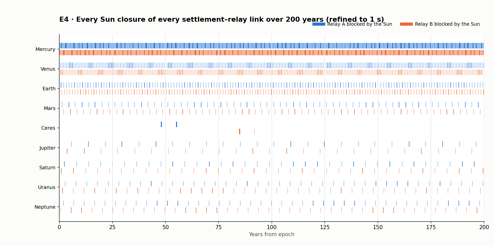

# E4 · Long-horizon scan with refined Sun-blockage boundaries (hub Ceres)

**Reproduce:** `python3 -m evidence.appendix e4` → `e4/closures.csv`, `e4/boundary_tests.csv`, `e4/important_transitions.csv`, `e4/maintenance_boundaries.csv`, `e4/route_delay_ranges.csv`, `e4/e4_summary.json`, `e4/e4_closures.png`.

**Tier claimed: 3.**

## Method

- Span: 200 Julian years from the epoch; every settlement's link to Relay A and Relay B.
- Coarse scan: every 6 h with the instant-time Sun test (vectorized propagation, checked against `network_graph.System` to 2.5e-16 AU).
- Each coarse change is re-bracketed ±1 day and bisected to **1 s tolerance** with the brief's exact rule: moving-receiver light time and the segment from the sender at emission to the receiver at arrival.
- **Shortest closure found: 6.68 days**, so a 6 h step cannot miss a whole closure (it would need to be shorter than the step). Closures are set by the planet's motion relative to a relay (a few degrees of angle, several days at the fastest, Mercury).
- Relay A ↔ Relay B is never blocked: both orbit at √8 AU, 90° apart, so their line passes 2 AU from the Sun.

## Boundary tests (before / at / after)

5748 refined boundaries. At each one the launch status was evaluated at t − 1 s, t and t + 1 s: **5748 of 5748** flip exactly at t (open → blocked at a start, blocked → open at an end).

Worked example (Earth → Relay A, first closure): coarse bracket [276.750, 279.000] d, refined start h 6667.9406 (day 277.83086). Status at t − 1 s: open; at t: sun-blocked; at t + 1 s: sun-blocked. The last open launch (h 6667.9403) still arrives at h 6668.4723 (clearance 0.1000 AU): **packets already in flight are unaffected**; a sender that knows the geometry waits or re-routes for later launches.

## Important transitions and the route chosen on each side

| Link | Which | Event | h | Year | Closure | Route before | Route after |
|---|---|---|---|---|---|---|---|
| Mercury–Relay A | first closure | start | 1,982.88 | 0.23 | 11.1 d | Mercury → Relay B → Ceres | Mercury → Relay B → Ceres |
| Mercury–Relay A | first closure | end | 2,249.55 | 0.26 | 11.1 d | Mercury → Relay A → Ceres | Mercury → Relay A → Ceres |
| Mercury–Relay A | longest closure | start | 1,712,131.28 | 195.31 | 11.1 d | Mercury → Relay B → Ceres | Mercury → Relay B → Ceres |
| Mercury–Relay A | longest closure | end | 1,712,398.05 | 195.35 | 11.1 d | Mercury → Relay B → Ceres | Mercury → Relay B → Ceres |
| Mercury–Relay B | first closure | start | 525.81 | 0.06 | 8.7 d | Mercury → Relay A → Ceres | Mercury → Relay A → Ceres |
| Mercury–Relay B | first closure | end | 733.79 | 0.08 | 8.7 d | Mercury → Relay A → Ceres | Mercury → Relay A → Ceres |
| Mercury–Relay B | longest closure | start | 1,701,564.54 | 194.11 | 11.1 d | Mercury → Relay A → Ceres | Mercury → Relay A → Ceres |
| Mercury–Relay B | longest closure | end | 1,701,831.35 | 194.14 | 11.1 d | Mercury → Relay B → Ceres | Mercury → Relay B → Ceres |
| Venus–Relay A | first closure | start | 4,039.72 | 0.46 | 14.4 d | Venus → Relay B → Ceres | Venus → Relay B → Ceres |
| Venus–Relay A | first closure | end | 4,384.87 | 0.50 | 14.4 d | Venus → Relay B → Ceres | Venus → Relay B → Ceres |
| Venus–Relay A | longest closure | start | 1,713,562.97 | 195.48 | 14.4 d | Venus → Relay B → Ceres | Venus → Relay B → Ceres |
| Venus–Relay A | longest closure | end | 1,713,908.13 | 195.52 | 14.4 d | Venus → Relay B → Ceres | Venus → Relay B → Ceres |
| Venus–Relay B | first closure | start | 5,619.13 | 0.64 | 13.6 d | Venus → Relay A → Ceres | Venus → Relay A → Ceres |
| Venus–Relay B | first closure | end | 5,945.98 | 0.68 | 13.6 d | Venus → Relay A → Ceres | Venus → Relay A → Ceres |
| Venus–Relay B | longest closure | start | 160,436.36 | 18.30 | 14.4 d | Venus → Relay A → Ceres | Venus → Relay A → Ceres |
| Venus–Relay B | longest closure | end | 160,781.51 | 18.34 | 14.4 d | Venus → Relay B → Ceres | Venus → Relay B → Ceres |
| Earth–Relay A | first closure | start | 6,667.94 | 0.76 | 20.6 d | Earth → Relay B → Ceres | Earth → Relay B → Ceres |
| Earth–Relay A | first closure | end | 7,161.40 | 0.82 | 20.6 d | Earth → Relay B → Ceres | Earth → Relay B → Ceres |
| Earth–Relay A | longest closure | start | 6,667.94 | 0.76 | 20.6 d | Earth → Relay B → Ceres | Earth → Relay B → Ceres |
| Earth–Relay A | longest closure | end | 7,161.40 | 0.82 | 20.6 d | Earth → Relay B → Ceres | Earth → Relay B → Ceres |
| Earth–Relay B | first closure | start | 9,504.51 | 1.08 | 19.7 d | Earth → Relay A → Ceres | Earth → Relay A → Ceres |
| Earth–Relay B | first closure | end | 9,976.89 | 1.14 | 19.7 d | Earth → Relay A → Ceres | Earth → Relay A → Ceres |
| Earth–Relay B | longest closure | start | 830,032.30 | 94.69 | 20.6 d | Earth → Relay A → Ceres | Earth → Relay A → Ceres |
| Earth–Relay B | longest closure | end | 830,525.76 | 94.74 | 20.6 d | Earth → Relay A → Ceres | Earth → Relay A → Ceres |
| Mars–Relay A | first closure | start | 11,504.88 | 1.31 | 27.7 d | Mars → Relay B → Ceres | Mars → Relay B → Ceres |
| Mars–Relay A | first closure | end | 12,169.20 | 1.39 | 27.7 d | Mars → Relay B → Ceres | Mars → Relay B → Ceres |
| Mars–Relay A | longest closure | start | 1,701,896.58 | 194.15 | 45.2 d | Mars → Relay B → Ceres | Mars → Relay B → Ceres |
| Mars–Relay A | longest closure | end | 1,702,982.44 | 194.27 | 45.2 d | Mars → Relay B → Ceres | Mars → Relay B → Ceres |
| Mars–Relay B | first closure | start | 17,426.17 | 1.99 | 41.5 d | Mars → Relay A → Ceres | Mars → Relay A → Ceres |
| Mars–Relay B | first closure | end | 18,421.72 | 2.10 | 41.5 d | Mars → Relay B → Ceres | Mars → Relay B → Ceres |
| Mars–Relay B | longest closure | start | 1,190,552.21 | 135.81 | 45.2 d | Mars → Relay A → Ceres | Mars → Relay A → Ceres |
| Mars–Relay B | longest closure | end | 1,191,636.59 | 135.94 | 45.2 d | Mars → Relay A → Ceres | Mars → Relay A → Ceres |
| Ceres–Relay A | first closure | start | 418,978.04 | 47.80 | 182.2 d | Neptune → Relay B → Ceres | Neptune → Relay B → Ceres |
| Ceres–Relay A | first closure | end | 423,350.85 | 48.29 | 182.2 d | Neptune → Relay B → Ceres | Neptune → Relay B → Ceres |
| Ceres–Relay A | longest closure | start | 481,471.08 | 54.92 | 190.2 d | Neptune → Relay B → Ceres | Neptune → Relay B → Ceres |
| Ceres–Relay A | longest closure | end | 486,035.61 | 55.45 | 190.2 d | Neptune → Relay B → Ceres | Neptune → Relay B → Ceres |
| Ceres–Relay B | first closure | start | 742,237.68 | 84.67 | 157.0 d | Neptune → Relay A → Ceres | Neptune → Relay A → Ceres |
| Ceres–Relay B | first closure | end | 746,005.25 | 85.10 | 157.0 d | Neptune → Relay B → Ceres | Neptune → Relay B → Ceres |
| Ceres–Relay B | longest closure | start | 742,237.68 | 84.67 | 157.0 d | Neptune → Relay A → Ceres | Neptune → Relay A → Ceres |
| Ceres–Relay B | longest closure | end | 746,005.25 | 85.10 | 157.0 d | Neptune → Relay B → Ceres | Neptune → Relay B → Ceres |
| Jupiter–Relay A | first closure | start | 48,685.32 | 5.55 | 50.9 d | Jupiter → Relay B → Ceres | Jupiter → Relay B → Ceres |
| Jupiter–Relay A | first closure | end | 49,906.29 | 5.69 | 50.9 d | Jupiter → Relay B → Ceres | Jupiter → Relay B → Ceres |
| Jupiter–Relay A | longest closure | start | 398,685.79 | 45.48 | 51.8 d | Jupiter → Relay B → Ceres | Jupiter → Relay B → Ceres |
| Jupiter–Relay A | longest closure | end | 399,929.26 | 45.62 | 51.8 d | Jupiter → Relay B → Ceres | Jupiter → Relay B → Ceres |
| Jupiter–Relay B | first closure | start | 31,713.31 | 3.62 | 45.2 d | Jupiter → Relay A → Ceres | Jupiter → Relay A → Ceres |
| Jupiter–Relay B | first closure | end | 32,798.84 | 3.74 | 45.2 d | Jupiter → Relay A → Ceres | Jupiter → Relay A → Ceres |
| Jupiter–Relay B | longest closure | start | 1,633,618.55 | 186.36 | 50.5 d | Jupiter → Relay A → Ceres | Jupiter → Relay A → Ceres |
| Jupiter–Relay B | longest closure | end | 1,634,829.46 | 186.50 | 50.5 d | Jupiter → Relay A → Ceres | Jupiter → Relay A → Ceres |
| Saturn–Relay A | first closure | start | 20,125.28 | 2.30 | 13.4 d | Saturn → Relay B → Ceres | Saturn → Relay B → Ceres |
| Saturn–Relay A | first closure | end | 20,447.25 | 2.33 | 13.4 d | Saturn → Relay B → Ceres | Saturn → Relay B → Ceres |
| Saturn–Relay A | longest closure | start | 70,679.41 | 8.06 | 31.1 d | Saturn → Relay B → Ceres | Saturn → Relay B → Ceres |
| Saturn–Relay A | longest closure | end | 71,426.79 | 8.15 | 31.1 d | Saturn → Relay B → Ceres | Saturn → Relay B → Ceres |
| Saturn–Relay B | first closure | start | 7,587.70 | 0.87 | 10.3 d | Saturn → Relay A → Ceres | Saturn → Relay A → Ceres |
| Saturn–Relay B | first closure | end | 7,834.10 | 0.89 | 10.3 d | Saturn → Relay A → Ceres | Saturn → Relay A → Ceres |
| Saturn–Relay B | longest closure | start | 1,102,494.36 | 125.77 | 31.2 d | Saturn → Relay A → Ceres | Saturn → Relay A → Ceres |
| Saturn–Relay B | longest closure | end | 1,103,243.66 | 125.85 | 31.2 d | Saturn → Relay A → Ceres | Saturn → Relay A → Ceres |
| Uranus–Relay A | first closure | start | 23,943.59 | 2.73 | 23.8 d | Uranus → Relay B → Ceres | Uranus → Relay B → Ceres |
| Uranus–Relay A | first closure | end | 24,513.97 | 2.80 | 23.8 d | Uranus → Relay B → Ceres | Uranus → Relay B → Ceres |
| Uranus–Relay A | longest closure | start | 1,085,690.90 | 123.85 | 23.8 d | Uranus → Relay B → Ceres | Uranus → Relay B → Ceres |
| Uranus–Relay A | longest closure | end | 1,086,261.70 | 123.92 | 23.8 d | Uranus → Relay A → Ceres | Uranus → Relay A → Ceres |
| Uranus–Relay B | first closure | start | 12,901.00 | 1.47 | 23.7 d | Uranus → Relay A → Ceres | Uranus → Relay A → Ceres |
| Uranus–Relay B | first closure | end | 13,470.51 | 1.54 | 23.7 d | Uranus → Relay A → Ceres | Uranus → Relay A → Ceres |
| Uranus–Relay B | longest closure | start | 367,710.42 | 41.95 | 23.8 d | Uranus → Relay A → Ceres | Uranus → Relay A → Ceres |
| Uranus–Relay B | longest closure | end | 368,281.56 | 42.01 | 23.8 d | Uranus → Relay A → Ceres | Uranus → Relay A → Ceres |
| Neptune–Relay A | first closure | start | 16,212.55 | 1.85 | 16.7 d | Neptune → Relay B → Ceres | Neptune → Relay B → Ceres |
| Neptune–Relay A | first closure | end | 16,613.14 | 1.90 | 16.7 d | Neptune → Relay B → Ceres | Neptune → Relay B → Ceres |
| Neptune–Relay A | longest closure | start | 1,261,323.79 | 143.89 | 22.0 d | Neptune → Relay B → Ceres | Neptune → Relay B → Ceres |
| Neptune–Relay A | longest closure | end | 1,261,851.35 | 143.95 | 22.0 d | Neptune → Relay B → Ceres | Neptune → Relay B → Ceres |
| Neptune–Relay B | first closure | start | 5,468.75 | 0.62 | 17.1 d | Neptune → Relay A → Ceres | Neptune → Relay A → Ceres |
| Neptune–Relay B | first closure | end | 5,879.33 | 0.67 | 17.1 d | Neptune → Relay A → Ceres | Neptune → Relay A → Ceres |
| Neptune–Relay B | longest closure | start | 520,903.20 | 59.42 | 22.0 d | Neptune → Relay A → Ceres | Neptune → Relay A → Ceres |
| Neptune–Relay B | longest closure | end | 521,431.81 | 59.48 | 22.0 d | Neptune → Relay A → Ceres | Neptune → Relay A → Ceres |

For Ceres's own links the route shown is Neptune's (the slowest client). In every case a route to Ceres exists on both sides of the boundary.

## Scheduled maintenance boundaries (exact)

| Link | Window | First blocked launch | Last open launch arrives | Status t−1 s / t | First open launch after |
|---|---|---|---|---|---|
| Neptune -> Relay B | [2, 26) | h -2.4154 | h 1.9999 | open / maintenance | h 26.0002 |
| Relay B -> Neptune | [2, 26) | h -2.4152 | h 1.9999 | open / maintenance | h 26.0002 |
| Ceres -> Relay B | [240, 264) | h 239.6600 | h 239.9999 | open / maintenance | h 264.0002 |
| Relay B -> Ceres | [240, 264) | h 239.6600 | h 239.9998 | open / maintenance | h 264.0002 |

A launch is blocked when its flight interval [t_e, t_a] overlaps the window, so the last good launch lands just before the window opens. For Relay B–Neptune this makes launches from about h −2.4 fail (a ~4.4 h flight would still be in the air at h 2). The brief also says no maintenance applies before hour 0; the two statements overlap only for these pre-hour-0 launches, which the scenarios do not use (sessions are pinned to Relay A).

## Link availability and route-delay ranges, every settlement (to the hub)

| Settlement | Closures | Shortest | Longest | Avail. Relay A | Avail. Relay B | Both relays blocked | Delay min / median / max |
|---|---|---|---|---|---|---|---|
| Mercury | 1577 | 6.7 d | 11.1 d | 90.95% | 90.94% | 0.00 d | 0.34 / 0.72 / 1.50 h |
| Venus | 566 | 13.4 d | 14.4 d | 94.62% | 94.62% | 0.00 d | 0.32 / 0.71 / 1.51 h |
| Earth | 316 | 19.3 d | 20.6 d | 95.69% | 95.69% | 0.00 d | 0.28 / 0.72 / 1.53 h |
| Mars | 128 | 27.7 d | 45.2 d | 96.88% | 96.88% | 0.00 d | 0.21 / 0.74 / 1.56 h |
| Jupiter | 50 | 42.4 d | 51.8 d | 98.34% | 98.36% | 0.00 d | 0.38 / 1.08 / 1.76 h |
| Saturn | 71 | 9.2 d | 31.2 d | 98.99% | 98.95% | 0.00 d | 0.89 / 1.65 / 2.40 h |
| Uranus | 80 | 22.2 d | 23.8 d | 98.73% | 98.73% | 0.00 d | 2.24 / 2.97 / 3.82 h |
| Neptune | 82 | 13.2 d | 22.0 d | 99.03% | 99.03% | 0.00 d | 3.78 / 4.47 / 5.15 h |

Ceres (hub) links: 4 closures, longest 190.2 d. Both relays blocked at Ceres: 0 periods.

## Poorest service

- Longest delay: **Neptune**, up to 5.15 h one way (around year 69.9).
- Lowest link availability: **Mercury** (90.94% on its worse relay).
- No settlement ever loses both relays at once, so a route to the hub always exists in the model (re-routing is needed at each closure).

**Limit:** this is numerical evidence over the modeled 200 years, not a proof for all time.
