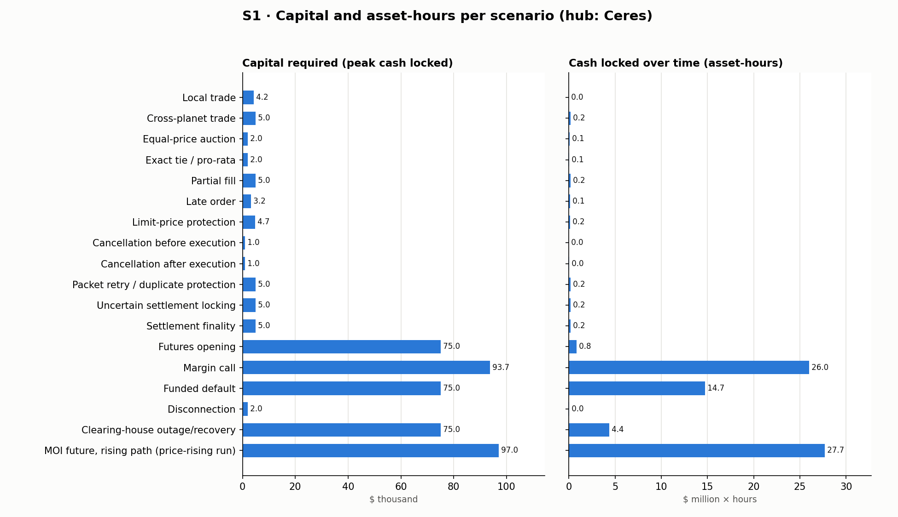

# S1 · Per-scenario capital, asset-hours, and communications

Hub: **Ceres**. Opening balance sheet: $310,000 and 3,000 shares across 6 accounts (the guarantee fund is funded after hour 0 by contributions, not in the opening sheet).

**Reproduce:** `python3 -m evidence.appendix s1` → `s1/s1_scenarios.csv`, `s1/s1_scenarios.json`, `s1/s1_capital.png`.

**Definitions** (brief Section 7): *capital required* = peak NeoDollars encumbered at one moment (order locks, margin, guarantee fund); *asset-hours* = encumbered amount integrated over time, per asset (value in transit between ledgers is not encumbered and is not counted); *capital utilization* = peak / opening NeoDollars; *capital efficiency* = peak / value settled; *communication efficiency* = all packets (originations + launches) / completed transactions. *Completion* = the latest moment any party's result became usable.

| Scenario | Checks | Completion h | Capital required | Utilization | Cash-hours | Share-hours | Value settled | Quota pkts | Launches |
|---|---|---|---|---|---|---|---|---|---|
| Local trade | 9/9 | 1.50 | $4,200 | 1.4% | 0 | 50 | $4,000 | 0 | 0 |
| Cross-planet trade | 11/11 | 39.46 | $5,000 | 1.6% | 171,452 | 3,074 | $4,750 | 8 | 64 |
| Equal-price auction | 6/6 | 48.41 | $2,000 | 0.6% | 65,017 | 307 | $1,000 | 10 | 80 |
| Exact tie / pro-rata | 4/4 | 48.47 | $2,000 | 0.6% | 61,424 | 514 | $1,500 | 14 | 112 |
| Partial fill | 5/5 | 39.46 | $5,000 | 1.6% | 171,452 | 1,844 | $2,850 | 8 | 64 |
| Late order | 9/9 | 101.70 | $3,200 | 1.0% | 132,217 | 776 | $2,610 | 22 | 176 |
| Limit-price protection | 8/8 | 39.40 | $4,740 | 1.5% | 150,768 | 2,135 | $3,325 | 16 | 128 |
| Cancellation before execution | 6/6 | — | $1,000 | 0.3% | 9,210 | 307 | $0 | 5 | 40 |
| Cancellation after execution | 4/4 | 39.46 | $1,000 | 0.3% | 34,290 | 307 | $975 | 9 | 72 |
| Packet retry / duplicate protection | 8/8 | 44.64 | $5,000 | 1.6% | 171,452 | 3,074 | $4,750 | 10 | 81 |
| Uncertain settlement locking | 6/6 | 39.46 | $5,000 | 1.6% | 171,452 | 3,074 | $4,750 | 12 | 108 |
| Settlement finality | 4/4 | 39.46 | $5,000 | 1.6% | 171,452 | 10,213 | $4,750 | 8 | 64 |
| Futures opening | 7/7 | 4.61 | $75,000 | 24.2% | 813,244 | 0 | $75,000 | 8 | 64 |
| Margin call | 8/8 | 301.05 | $93,700 | 30.2% | 25,989,277 | 0 | $213,700 | 50 | 400 |
| Funded default | 8/8 | 61.05 | $75,000 | 24.2% | 14,731,741 | 0 | $197,000 | 36 | 288 |
| Disconnection | 5/5 | 106.82 | $2,050 | 0.7% | 27,835 | 2,064 | $2,910 | 8 | 76 |
| Clearing-house outage/recovery | 5/5 | 73.49 | $75,000 | 24.2% | 4,360,660 | 0 | $77,000 | 10 | 149 |
| MOI future, rising path (price-rising run) | 0/0 | 304.63 | $97,000 | 31.3% | 27,709,626 | 0 | $217,000 | 53 | 424 |

## Scale requirement (≥ 25% of opening NeoDollars encumbered at once)

Met in: **Margin call** ($93,700 = 30.2% at h 224.73), **MOI future, rising path (price-rising run)** ($97,000 = 31.3% at h 169.59).

The futures peaks include the $50,000 guarantee fund, which is real cash encumbered at Ceres Clearing for default losses.

## Exposure (largest possible loss per side)

| Scenario | Largest buyer exposure (shares → 0) | Futures |
|---|---|---|
| Local trade | $4,000 | — |
| Cross-planet trade | $4,750 | — |
| Equal-price auction | $1,000 | — |
| Exact tie / pro-rata | $800 | — |
| Partial fill | $2,850 | — |
| Late order | $1,125 | — |
| Limit-price protection | $1,900 | — |
| Cancellation before execution | — | — |
| Cancellation after execution | $975 | — |
| Packet retry / duplicate protection | $4,750 | — |
| Uncertain settlement locking | $4,750 | — |
| Settlement finality | $4,750 | — |
| Futures opening | — | long N-Eve max loss $100,000 (index to 0); short E-Alice unbounded, covered by margin + guarantee fund |
| Margin call | — | long N-Eve max loss $100,000 (index to 0); short E-Alice unbounded, covered by margin + guarantee fund |
| Funded default | — | long N-Eve max loss $100,000 (index to 0); short E-Alice unbounded, covered by margin + guarantee fund |
| Disconnection | $2,000 | — |
| Clearing-house outage/recovery | $2,000 | long N-Eve max loss $100,000 (index to 0); short E-Alice unbounded, covered by margin + guarantee fund |
| MOI future, rising path (price-rising run) | — | long N-Eve max loss $100,000 (index to 0); short E-Alice unbounded, covered by margin + guarantee fund |

Sellers of shares deliver shares they already own and receive cash, so their cash exposure is 0. The futures short has no payoff cap, so its loss is unbounded in principle; the evidence shows it is covered by posted margin first and the guarantee fund second (funded default: $15,000 + $7,000).

