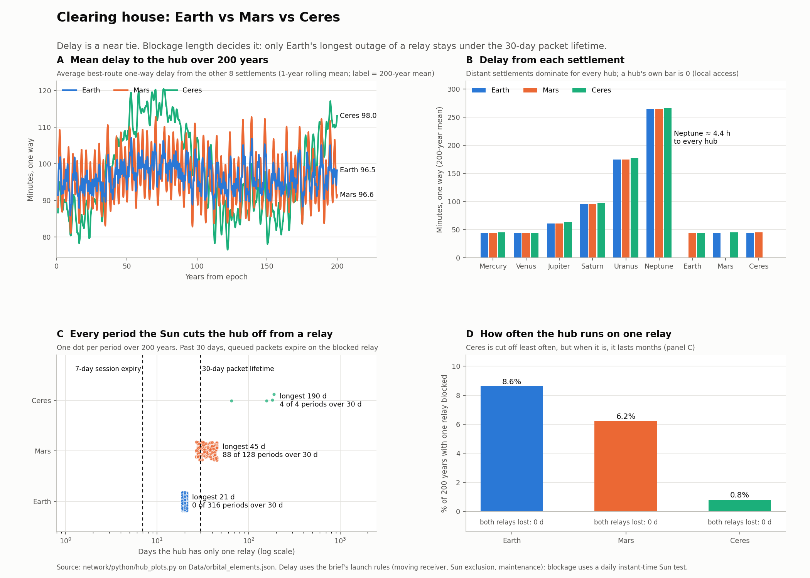
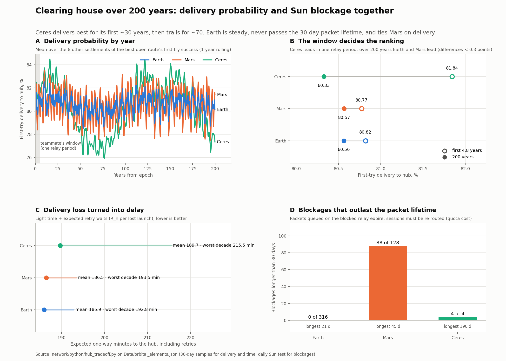

# Clearing hub location: Earth vs Mars vs Ceres

Analysis from 2026-10-03. Reproduce with `python3 network/python/hub_compare.py`
(routes from `network/python/network_graph.py`, which follows the brief's launch rules).

## Decision

**Ceres** (decided 2026-10-03, after rerunning every scenario at both hubs; see `hub-earth-vs-ceres.md`).
Market speed ties with Earth within 2%. Ceres is the more robust hub: it spends 0.8% of the time on a
single relay (Earth 8.6%) and needs 4 planned relay re-routes in 200 years (Earth 316). Costs we accept:
its rare blockages last up to 190 days (operators switch to the other relay ahead of each one), its worst
decade is 22 min slower, and with today's balance sheet it uses ~31% more backbone quota because most
collateral sits at Earth. The analysis below is kept as the record of the comparison.

## Delay: a tie

Best open backbone route from every other settlement to the hub.

| Hub | Mean one-way, h 0–720 | Mean one-way, 200 yr | Mean round trip, 200 yr | Worst one-way |
|---|---|---|---|---|
| Earth | 85.2 min | 96.5 min | 3.22 h | 5.19 h |
| Mars | 82.7 min | 96.6 min | 3.22 h | 5.18 h |
| Ceres | 82.1 min | 98.0 min | 3.27 h | 5.15 h |

- Neptune is the worst-served settlement for every hub (~4.4 h one way) and dominates.
- No hub ever had zero open routes (sampled at 4 h and 30 d steps, so short closures may be missed).

## Reliability: decides it

200-year scan, daily steps, Sun test at one instant (approximate).

| Hub | Time with one relay blocked | Longest single-relay spell | Both relays blocked |
|---|---|---|---|
| Earth | 8.6% | 21 days | never |
| Mars | 6.2% | 45 days | never |
| Ceres | 0.8% | 190 days | never |

- Spell length matters more than frequency. A session pinned to a blocked relay goes silent:
  sessions expire after 7 days with no session packet, packets after 30 days.
- Earth's spells stay under the 30-day packet lifetime, so queued messages survive.
- Mars's 45-day spells can outlast it, so it needs a rule to re-pin those sessions through
  the other relay (each new handshake costs 1 backbone quota packet).
- Ceres: rare but very long blockages, and Relay B to Ceres maintenance (hours 240–264) falls inside
  the 240-hour obligation window.

## Figure

Regenerate with `python3 network/python/hub_plots.py`. The deciding panel is C: over 200 years,
**0 of Earth's 316** single-relay blockages pass 30 days, against **88 of Mars's 128** and
**4 of Ceres's 4**. A blockage longer than the 30-day packet lifetime means packets queued on the
blocked relay expire, so sessions must be re-routed (one quota packet per new handshake).

## Delivery probability vs Sun blockage (teammate's Ceres result)

Regenerate with `python3 network/python/hub_tradeoff.py`.

| Hub | Delivery, first 4.8 yr | Delivery, 200 yr | Expected one-way incl. retries (worst decade) | Blockages > 30 d | Longest |
|---|---|---|---|---|---|
| Earth | 80.82% | 80.56% | 185.9 min (192.8) | 0 of 316 | 21 d |
| Mars | 80.77% | 80.57% | 186.5 min (193.5) | 88 of 128 | 45 d |
| Ceres | **81.84%** | 80.33% | 189.7 min (**215.5**) | 4 of 4 | **190 d** |

- Ceres really does deliver best over one relay period (the teammate's window), and for its first ~30 years.
  Its orbit almost matches the relays', so it drifts round them on a ~140-year cycle: it trails Earth by up
  to 3.0 points in years 30-105 and 170-200. Over 200 years it ranks 5th of 9 on delivery.
- Turning losses into retry delay, the three hubs are within 4 min on average, but Ceres's worst decade is
  22 min slower than Earth's.
- Retries are quota-exempt, so a lower delivery probability costs time. A blockage that outlasts the 30-day
  packet lifetime costs quota (new sessions, resubmissions) and keeps collateral locked in an unknown state.
  Earth is the only hub with none.

## Line for the paper

Hub location barely changes market speed (within 2% across every scenario). We chose Ceres because it is
the more robust hub: a tenth of Earth's time on a single relay and 4 relay re-routes in 200 years instead of
316. Its rare long blockages are handled by switching sessions to the other relay before they begin.

## To firm up for E4

Rerun the reliability scan with the brief's moving-receiver rule and refined spell
boundaries before quoting the numbers as evidence.
