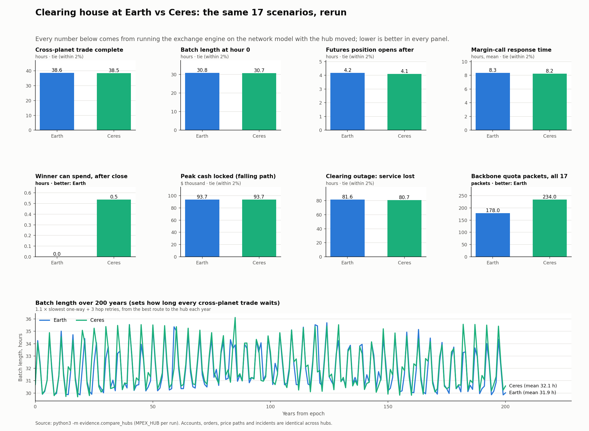

# Earth vs Ceres as the hub: every scenario rerun

Generated 2026-10-03 with `python3 -m evidence.compare_hubs` (raw numbers in `hub-earth-vs-ceres.json`).
The hub setting `MPEX_HUB` moves the global batch market, the clearing house, the margin windows and
the sessions together. Accounts, orders, price paths, incidents and rules are identical in both runs.



## Result in one line

Moving the hub to Ceres changes **speed by under 2%** and **communication cost by +31%**. The difference
comes from where our accounts and money sit, not from the orbits.

## The numbers

| Measure | Earth hub | Ceres hub | Verdict |
|---|---|---|---|
| All 17 scenarios pass | 17 / 17 | 17 / 17 | both work |
| Cross-planet trade complete (order to both legs usable) | 38.6 h | 38.5 h | tie |
| Batch length at hour 0 | 30.76 h | 30.68 h | tie |
| Batch length, 200-year mean (range) | 31.9 h (29.9–35.7) | 32.1 h (29.7–36.1) | tie |
| Batch length at +1 / +10 / +100 years (E5 epochs) | 34.2 / 31.4 / 33.0 h | 34.1 / 31.4 / 33.3 h | tie |
| Futures position opens after margins ship | 4.17 h | 4.11 h | tie |
| Margin-call response time (mean of 5) | 8.34 h | 8.22 h | tie |
| Peak cash locked, falling path | $93,700 | $93,700 | tie |
| Guarantee fund in place | h 0.10 | h 0.66 | Earth |
| Winner can spend after the contract closes | at once | +0.54 h | Earth |
| Clearing-house outage (72 h): financial service lost | 81.6 h | 80.7 h | tie |
| **Backbone quota packets, all 17 scenarios** | **178** | **234 (+31%)** | **Earth** |
| Backbone launches, all 17 scenarios | 1,463 | 1,966 (+34%) | Earth |

Margin windows (round trip to the hub + one hop retry):

| Account | Earth hub | Ceres hub |
|---|---|---|
| E-Alice, E-Bob (Earth) | local | 2.74 h |
| M-Carla, M-Diego (Mars) | 2.76 h | 2.49 h |
| N-Eve (Neptune) | 17.07 h | 16.93 h |
| C-Finn (Ceres) | 2.74 h | local |

## Why speed is a tie

Every cross-planet trade waits for the batch, and the batch waits for Neptune: about 4.1 h one way plus
3 hop retries of about 8.7 h each. Neptune is about 30 AU from every inner hub, so the batch length barely
moves (30.8 vs 30.7 h), and that sets the completion time of every cross-planet trade. Ceres's network edge
(its proximity to the relays in some decades) is real but too small to show up once Neptune dominates.

## Why Earth wins on communication

Our balance sheet has 2 accounts at Earth ($115,000 and 1,000 shares) and 1 at Ceres ($35,000). The futures
short (E-Alice) and both guarantee-fund contributors are at Earth. With the hub at Ceres, all of that cash
must travel over the backbone before it can be used:
- every Earth margin and fund contribution becomes a transfer plus a status reply;
- winners at Earth wait for their payout to travel home (+0.54 h);
- the fund is in place at h 0.66 instead of h 0.10.

That is 56 more quota packets (+31%) for the same 17 scenarios. Communication efficiency is a scored measure
(Section 7), and the shared quota is 600 per 24 h.

## What would change the answer

The hub should sit where most accounts and collateral sit. This is a property of our balance sheet, not of
the planets. If the team moves the futures traders or the guarantee contributors to Ceres, rerun
`python3 -m evidence.compare_hubs` and Ceres will likely win the communication measure instead.

## Combined with the network analysis

| Factor | Earth | Ceres | Source |
|---|---|---|---|
| Delivery probability, relays switched ahead of blockages | 94.23% | 94.28% | teammate's metric, switching each step |
| Time on a single relay (exposed to one outage) | 8.6% | 0.8% | `network/python/hub_plots.py` |
| Relay re-routing events in 200 years | 316 | 4 | same |
| Worst-decade expected delay incl. retries | 192.8 min | 215.5 min | `network/python/hub_tradeoff.py` |
| Market performance (17 scenarios) | tie | tie | this note |
| Communication cost (17 scenarios) | 178 packets | 234 packets | this note |

**Decision: Ceres** (the team's call, 2026-10-03). Market speed and capital use tie, and Ceres is the more
robust hub (0.8% of the time on one relay vs 8.6%; 4 re-routes vs 316). Accepted costs: about 31% more backbone
quota with today's Earth-heavy balance sheet, Earth winners wait ~0.5 h to spend payouts, and a worst decade
22 min slower. Moving the large accounts or guarantee contributors to Ceres would remove the quota cost.

## How to see it

```
python3 -m evidence.compare_hubs                    # rerun both hubs, redraw this figure
python3 serve.py                                    # dashboard, hub at Ceres (default)
MPEX_HUB=Earth python3 serve.py --port 8001         # same dashboard with the hub at Earth
```
